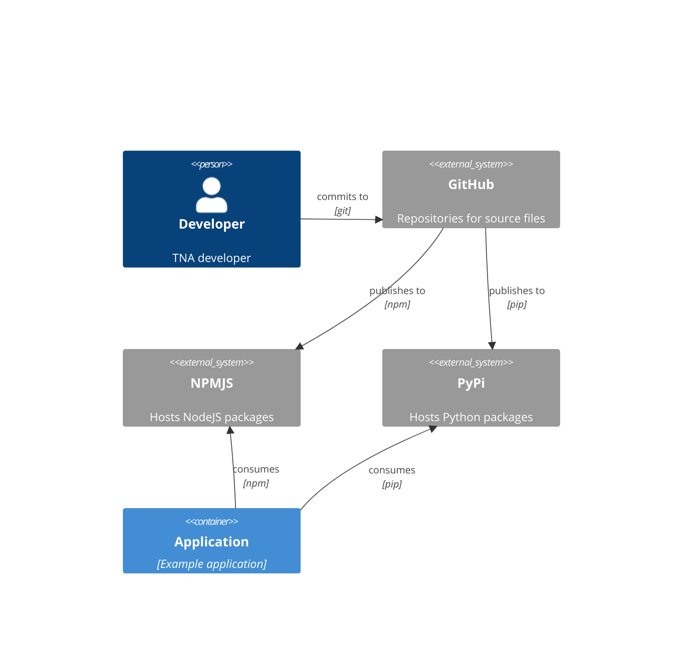
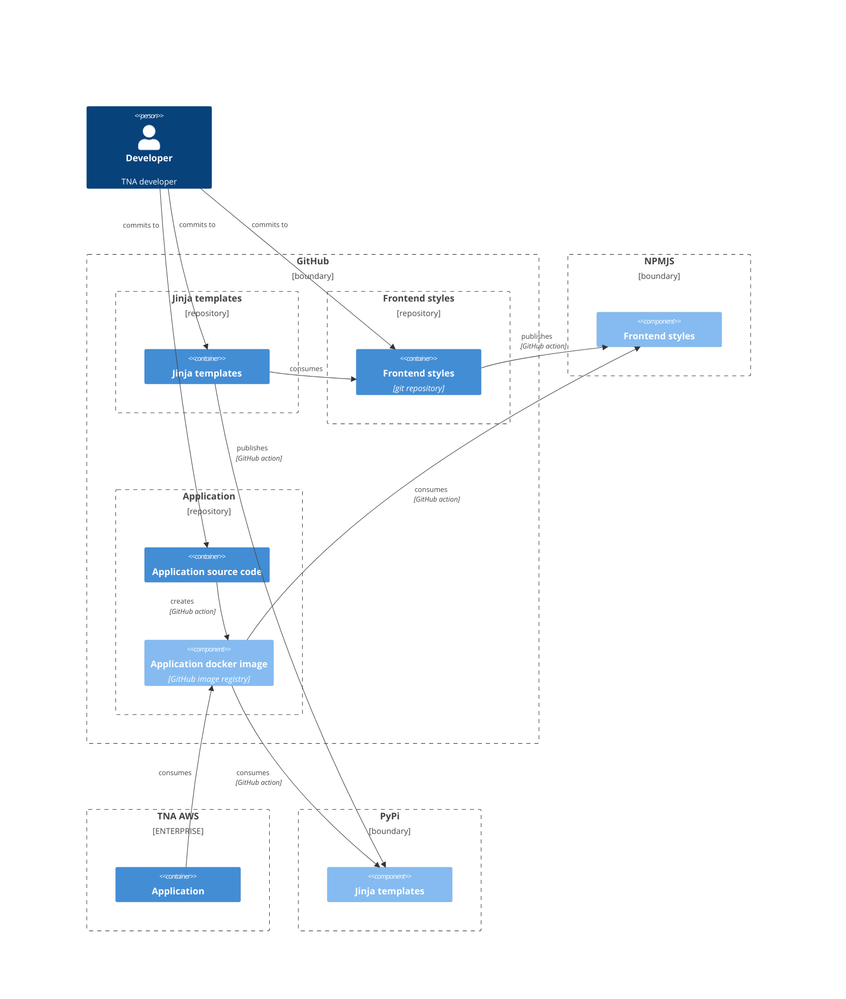

# The National Archives Frontend

[](https://github.com/nationalarchives/tna-frontend/actions/workflows/test.yml?query=branch%3Amain)
[](https://github.com/nationalarchives/tna-frontend/releases)
[](https://www.npmjs.com/package/@nationalarchives/frontend)
[](https://github.com/nationalarchives/tna-frontend/blob/main/.nvmrc)
[](https://github.com/nationalarchives/tna-frontend/blob/main/LICENCE)

The National Archives Frontend contains the code you need to start building a user interface for  National Archives platforms and services.

## Quickstart

```sh
# Node version
nvm use

# Install dependencies
npm install

# Start Storybook
npm start
```

### Updating

```sh
# Upgrade all Storybook packages
npx sb upgrade
```

### Release

```sh
# Update version in package.json
npm install
# Commit and push to main
git tag v0.1.0
git push origin --tags
# Create a new release on GitHub: https://github.com/nationalarchives/tna-frontend/releases/new
```

## Needs

TNA needs a frontend toolkit that is:

- standardised - a single source of truth for all TNA that follows all our coding standards (currently non-existent)
- version controlled - as well as [semantically versioned](https://semver.org/) with a [changelog](https://keepachangelog.com/en/1.0.0/)
- open - all source code should be [open and available to anyone](https://www.gov.uk/service-manual/service-standard/point-12-make-new-source-code-open)
- accessible - all components meet WCAG 2.1 AA standards
- progressively enhanced - all components should still be operable without JavaScript, CSS or both
- importable into projects (via a service such as [NPM](https://www.npmjs.com/search?q=nationalarchives)) - to make dependency management as simple as possible
- agnostic - the implementation for the markup of the components can be replicated in any required technology (because we have Python, PHP and Java applications throughout the organisation)
- testable - both from an internal perspective as well as providing scenarios and expected results for language implimentations to be able to validate against
- lean - minimal reliance on other languages and dependencies to ensure good extendability and speed of development and deployment
- automatically published - leveraging CI/CD, creating a new release version should be as simple as possible

It would also be nice to have a toolkit that is:

- extendable - rather than providing a static snapshot of the toolkit, we should always be able to extend it for any given application
- documentable - not just from a technical perspective but also from a user-centred design perspective with best practices of when and how to use each component (this might be a separate project where we can [share information such as user research](https://www.gov.uk/service-manual/service-standard/point-13-use-common-standards-components-patterns))
- prototype-able - by using Nunjucks, we could easily create a toolkit that integrated with the [GOV.UK Prototype Kit](https://prototype-kit.service.gov.uk/docs/) which means we could very easily create high fidelity prototypes to test with, ultimately helping with user research

## Current solutions

There is already a solution in [nationalarchives/tdr-components](https://github.com/nationalarchives/tdr-components) which is specific to TDR and extends the GOV.UK components and styles. We need to create a more generic set of components that are suitable for every TNA service, while still extending the GOV.UK components and styles but with a more TNA-branded look and feel.

We also have [nationalarchives/tna-frontend-design-toolkit](https://github.com/nationalarchives/tna-frontend-design-toolkit) which aims to provide similar functionality but isn't as featureful as we need and isn't published to NPM which means it has to be [copied into the projects that require it](https://github.com/nationalarchives/ds-wagtail/tree/develop/sass/tna-toolkit).

## Proposed solution

This repository should hold all the JavaScript and SCSS source files required for all the frontend styles along with tests and expected markup.

### Output

The source files will be compiled down to a NodeJS package and deployed to [NPM](https://www.npmjs.com/). The package will contain:

- All the JavaScript and SCSS source files which can be imported into a projects source code and compiled by the project (which will allow for tree shaking and application-specific modifications)
- An AMD/UMD/IIFE (TBD) ES5 JavaScript file which can be included with a normal `<script>` element
- A single CSS file containing all the styles which can be included with a normal `<style>` element
- The Nunjucks templates for each component that might be required in other projects such as prototyping tools (other implementations can be made such as [Jinja templates](https://github.com/nationalarchives/tna-frontend-jinja))

### Component resources

Each component in this repository should contain:

- Nunjucks template - only used to display the component within the examples page and aid development
- SCSS - which could either be imported as a standalone styles declaration or as part of the compiled output
- JavaScript (ESNext) - if there is any progressive enhancement required on the component
- Options/properties - a list of the configurable properties of the component and their types
- Test scenarios - a variety of configurations and their expected outputs that can be used by either this repository or other implementations of the components (e.g. Jinja)

### Technologies

- SCSS (used by GDS, is the de facto standard CSS preprocessor, already using in ETNA)
- Webpack - compilation of JavaScript and CSS (used by numerous TNA projects already)
- Babel - will allow us to use ESNext or possibly even TypeScript (although this could go against the lean requirement)
- Storybook - allow viewing and testing of components (we have already used this elsewhere in TNA)

### Relationship to other resources

#### System context



#### Component diagram


