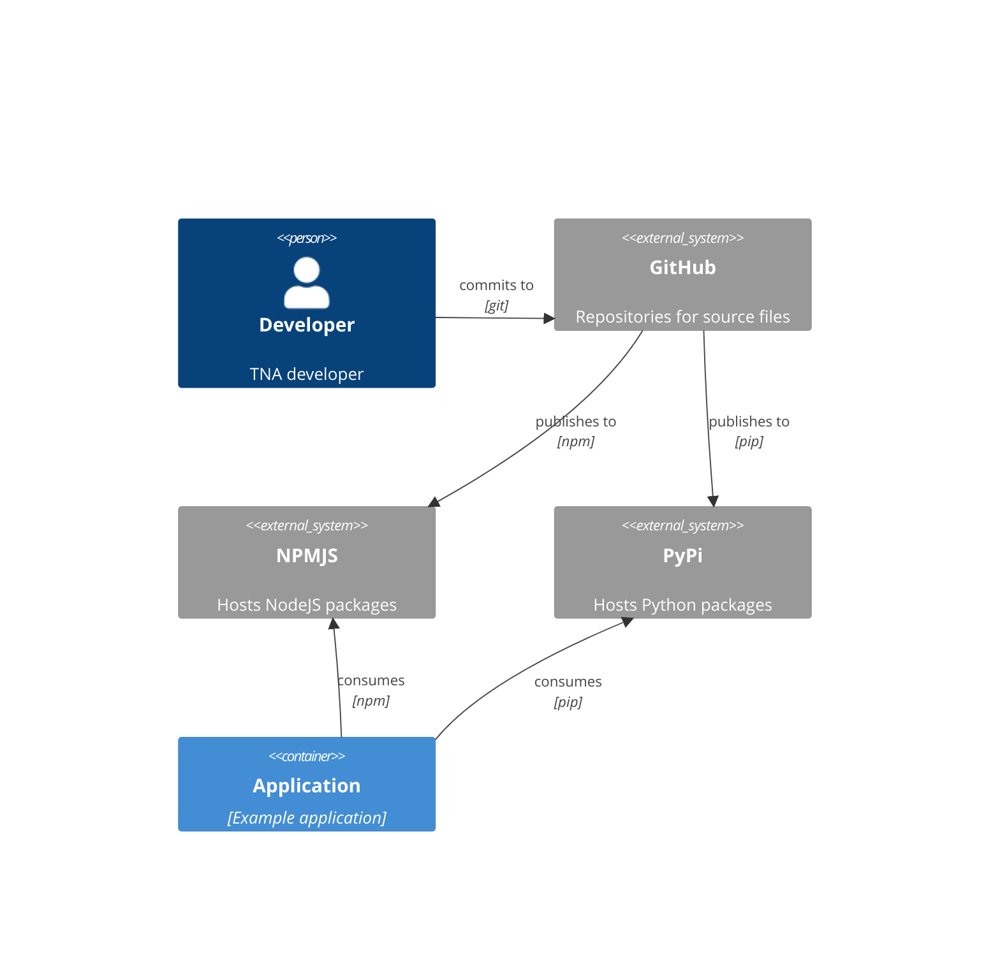

# The National Archives Frontend

A collection of components that can be used on TNA projects.

This repository should hold all the JavaScript and SCSS source files required for all the frontend styles along with tests and expected markup.

## Output

The source files will be compiled down to a NodeJS package and deployed to [NPM](https://www.npmjs.com/). The package will contain:

- All the JavaScript and SCSS source files which can be imported into a projects source code and compiled by the project (which will allow for tree shaking and application specific modifications)
- An AMD/UMD/IIFE (TBD) ES5 JavaScript file which can be included with a normal `<script>` element
- A single CSS file containing all the styles which can be included with a normal `<style>` element
- The Nunjucks templates for each component that might be required in other projects such as prototyping tools (other implementations can be made such as [Jinja templates](https://github.com/nationalarchives/tna-frontend-jinja))

## Component resources

Each component in this repository should contain:

- Nunjucks template - only used to display the component within the examples page and aid development
- SCSS - which could either be imported as a standalone styles declaration or as part of the compiled output
- JavaScript (ESNext) - if there is any progressive enhancement required on the component
- Options/properties - a list of the configurable properties of the component and their types
- Test scenarios - a variety of configurations and their expected outputs which can be used by either this repository or other implementations of the components (e.g. Jinja)

## Technologies

- Webpack - compilation of JavaScript and CSS
- Storybook - allow viewing and testing of components

## Relationship to other resources

### System context

### Component diagram

